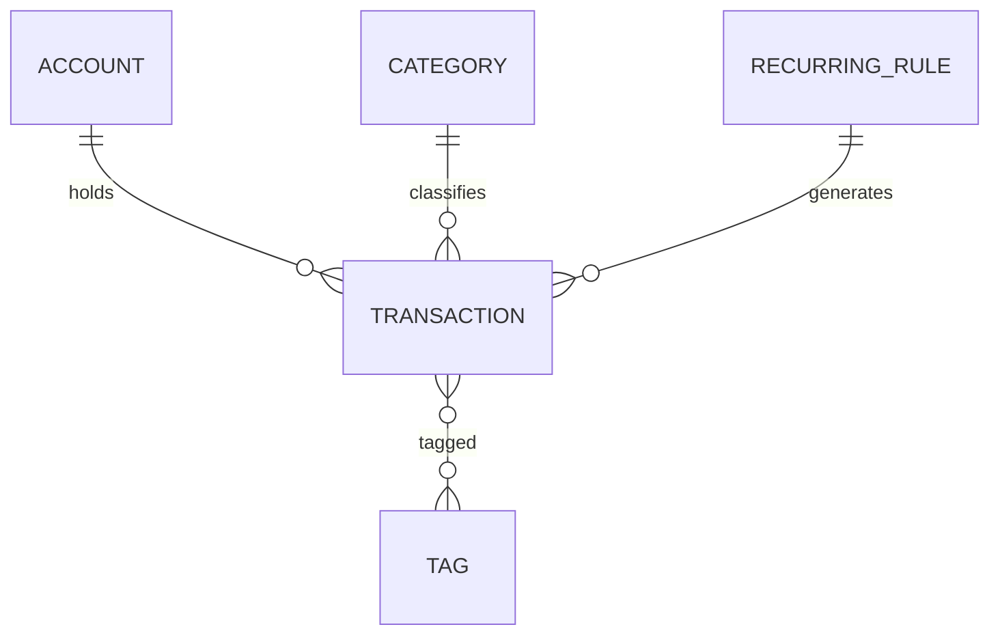
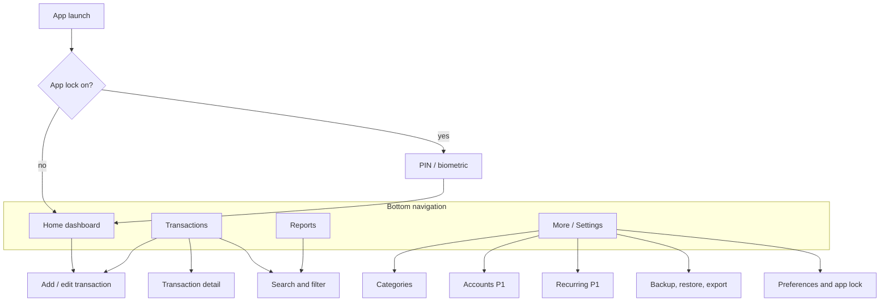
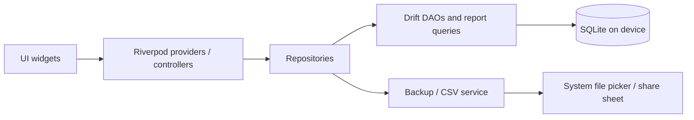

# PRD — Local Expense Tracker

**Author:** Efrem · **Date:** 2026-09-29 · **Status:** Draft v0.1

---

## 1. Overview

A personal expense tracker that runs entirely on one phone: log income and expenses in seconds, group them by category, and see where the money goes through reports and statistics. There is no account, no server and no sync — the phone is the only place the data lives.

**Problem.** Most finance apps demand sign-up, push cloud sync and bank linking, or bury simple logging under features. This app focuses on fast manual entry and honest reports, with full data ownership.

**Product principles**

- **Offline-only.** Every feature works with no network. The app does not request internet permission.
- **No auth.** Opening the app goes straight to the home screen. An optional on-device lock (PIN or biometric) protects against casual access.
- **Single device.** No multi-device sync. Data leaves the phone only when the user exports a file themselves.
- **Entry under 5 seconds.** Adding a typical expense takes at most 3 taps plus typing the amount.
- **Reports are the payoff.** Every entry should make the statistics more useful.

---

## 2. Goals, non-goals, success metrics

### Goals

1. Record income and expenses with amount, category, date, account and an optional note.
2. Manage categories (create, edit, archive, reorder) for both income and expenses.
3. Provide reports and statistics: totals, trends, category breakdowns and period comparisons.
4. Keep all data local, private and exportable.

### Non-goals (v1)

- User accounts, login, cloud sync, multi-device or shared/household finances
- Budgets and spending limits
- Bank or e-wallet API integration, SMS/notification parsing
- Investment, stock or crypto portfolio tracking
- Receipt OCR
- Web or desktop versions

### Success metrics (personal use)

| Metric | Target |
| --- | --- |
| Time to add an expense (app open → saved) | ≤ 5 s |
| Cold start to usable home screen | ≤ 1.5 s on a mid-range Android phone |
| Report screen render with 10,000 transactions | ≤ 500 ms |
| Days with at least one entry (habit) | ≥ 80% of days over 3 months |
| Data loss incidents | 0 (backups restore 100% of records) |

---

## 3. Target user and use cases

**Primary user:** one person tracking their own money on their own phone, in Indonesia (IDR as default currency), who wants a clear picture of monthly cash flow without handing data to a third party.

### User stories

| # | As a user, I want to… | So that… | Priority |
| --- | --- | --- | --- |
| US-01 | add an expense with amount, category and date | I know where money goes | P0 |
| US-02 | add income (salary, freelance, other) | I can see net cash flow | P0 |
| US-03 | create and edit my own categories with icon and color | the breakdown matches my life | P0 |
| US-04 | see this month's income, expense and balance on the home screen | I know where I stand at a glance | P0 |
| US-05 | see a pie/donut breakdown of expenses by category for any period | I spot my biggest spending areas | P0 |
| US-06 | see income vs expense trend by month | I know if I'm improving | P0 |
| US-07 | edit or delete any past transaction | mistakes are easy to fix | P0 |
| US-08 | search and filter transactions (text, category, amount, date) | I can find a specific payment | P0 |
| US-09 | export and import a backup file | I don't lose data when I change phones | P0 |
| US-10 | track multiple accounts (cash, bank, e-wallet) and transfers between them | balances per wallet stay correct | P1 |
| US-11 | set recurring transactions (rent, subscriptions, salary) | I don't re-enter fixed items | P1 |
| US-12 | compare this period with the previous one | I see what changed | P1 |
| US-13 | lock the app with PIN/biometrics | others can't open it on my phone | P1 |
| US-14 | export transactions to CSV | I can analyze them in a spreadsheet | P1 |
| US-15 | add tags to transactions (e.g. "trip-bali") | I can report across categories | P2 |
| US-16 | attach a receipt photo | I have proof of a purchase | P2 |
| US-17 | use a home-screen widget for quick add | entry is even faster | P2 |

P0 = MVP · P1 = v1.0 · P2 = later

---

## 4. Functional requirements

### 4.1 Transactions

| ID | Requirement |
| --- | --- |
| TX-01 | Transaction types: **Expense**, **Income**, **Transfer** (Transfer is P1, needs accounts). |
| TX-02 | Fields: amount (required, > 0), type (required), category (required for income/expense), date & time (default now), account (default account preselected), note (optional, ≤ 200 chars), tags (P2), receipt photo (P2). |
| TX-03 | Amounts stored as integers in the smallest unit (IDR has no minor unit → store rupiah as integer). No floating point. |
| TX-04 | Quick-add flow: FAB → amount keypad opens immediately → pick category from grid → Save. Date/account/note are optional expanders. |
| TX-05 | Amount keypad supports basic arithmetic (e.g. `25000+12500`) and thousand separators as you type (`25.000`). |
| TX-06 | The last used category and account are remembered per type. |
| TX-07 | Edit and delete any transaction; delete shows an **Undo** snackbar for 5 s instead of a confirm dialog. |
| TX-08 | Duplicate a transaction ("add again") from its detail screen. |
| TX-09 | Transaction list grouped by day with a daily net subtotal; infinite scroll by month. |

### 4.2 Categories

| ID | Requirement |
| --- | --- |
| CAT-01 | Separate category sets for Income and Expense. |
| CAT-02 | Each category has name, icon, color, type, sort order and archived flag. |
| CAT-03 | Seeded defaults on first launch. Expense: Food & Drinks, Transport, Groceries, Bills & Utilities, Shopping, Health, Entertainment, Education, Housing/Rent, Other. Income: Salary, Freelance, Gift, Other. |
| CAT-04 | Create, rename, recolor, reorder (drag) categories. |
| CAT-05 | Categories in use cannot be hard-deleted — they are **archived** (hidden from pickers, kept in reports). Unused categories can be deleted. |
| CAT-06 | Merge category A into B (reassigns all transactions, then deletes A). |
| CAT-07 | One level of categories only; no subcategories. |

### 4.3 Accounts / wallets (P1)

| ID | Requirement |
| --- | --- |
| ACC-01 | Accounts with name, type (Cash, Bank, E-wallet, Other), icon, color, opening balance. |
| ACC-02 | One default account "Cash" is created on first launch; single-account users never need to see the accounts screen. |
| ACC-03 | Balance = opening balance + income − expense ± transfers. |
| ACC-04 | Transfers move money between accounts and are **excluded** from income/expense reports. |
| ACC-05 | Balance adjustment entry to reconcile with the real balance (recorded as an adjustment, excluded from reports). |

### 4.4 Recurring transactions (P1)

| ID | Requirement |
| --- | --- |
| REC-01 | Rule: template transaction + frequency (daily, weekly, monthly on day N, yearly) + start date + optional end date. |
| REC-02 | On app open, due occurrences since the last run are generated (no background service required). |
| REC-03 | Option per rule: auto-create, or create as "pending" for the user to confirm. |
| REC-04 | Monthly on day 31 falls back to the month's last day. |

### 4.5 Search and filter

| ID | Requirement |
| --- | --- |
| SRCH-01 | Full-text search on note and category name. |
| SRCH-02 | Filters: type, category (multi), account (multi), date range, amount range, tags. |
| SRCH-03 | Filtered result shows count and total for the filter. |
| SRCH-04 | A filter can be opened from any chart segment (tap "Food" slice → list of those transactions). |

### 4.6 Settings

- Currency symbol and format (default `Rp`, `.` thousands separator, no decimals)
- First day of week (default Monday) and **start day of month** (e.g. 25th for payday-based months)
- Theme: light / dark / system
- App lock: off / PIN / biometric, with auto-lock timeout
- Backup & restore, CSV export
- Manage categories, accounts, recurring rules
- Erase all data (double confirmation)

---

## 5. Reports and statistics

All reports share a **period selector** (Week · Month · Year · Custom range, with ◀ ▶ to step periods) and a **scope filter** (all accounts or selected accounts). Transfers and balance adjustments are always excluded from income/expense figures.

### 5.1 Home dashboard

- Current period: **Income, Expense, Net** (Income − Expense), with % change vs previous period
- Total balance across accounts (P1)
- Top 3 expense categories this period with amounts
- 5 most recent transactions

### 5.2 Report catalog

| ID | Report | Chart | What it answers | Priority |
| --- | --- | --- | --- | --- |
| RPT-01 | Category breakdown | Donut + ranked list (amount, % of total, count) | Where did my money go? | P0 |
| RPT-02 | Income vs expense over time | Grouped bar per month (last 6 or 12) + net line | Am I saving or overspending? | P0 |
| RPT-03 | Daily spending | Bar per day in the month + average line | Which days am I spending most? | P0 |
| RPT-04 | Category trend | Line per selected category over months | Is Food rising? | P1 |
| RPT-05 | Period comparison | Table: category · this period · previous · Δ · Δ% | What changed vs last month? | P1 |
| RPT-06 | Cash-flow calendar | Month calendar heat-map with daily net | Spending patterns by date | P1 |
| RPT-07 | Account balance over time | Line per account | How did my balances move? | P1 |
| RPT-08 | Tag report | Totals per tag | How much did the Bali trip cost? | P2 |

### 5.3 Key statistics (shown as cards on the Reports screen)

| Statistic | Definition |
| --- | --- |
| Total income / expense / net | Sum for the period |
| Savings rate | (Income − Expense) / Income, shown only when Income > 0 |
| Average daily spend | Expense / days elapsed in period (not total days, for the current period) |
| Projected month-end spend | Average daily spend × days in month (current month only) |
| Largest expense | Single biggest expense transaction, tappable |
| Most frequent category | Category with the highest transaction count |
| Change vs previous period | Δ and Δ% for income, expense, net |
| No-spend days | Days in period with zero expenses |

### 5.4 Report rules

- Every chart element is tappable and drills down to the filtered transaction list (SRCH-04).
- Empty states explain what to do ("Add your first expense to see this chart").
- All aggregations run as SQL queries on the local DB, not in-memory loops over all rows.
- Reports respect the custom **start day of month** setting.

---

## 6. Data model, storage, backup and privacy

### 6.1 Storage

- **SQLite** on device (via Drift in Flutter), single database file in the app's private storage.
- Schema versioned with migrations; migration tests required for every schema change.
- All timestamps stored as UTC epoch ms plus the user's time zone for display; the transaction "date" is a local date (`YYYY-MM-DD`) so a late-night entry never jumps to another day.

### 6.2 Entities

| Table | Key columns |
| --- | --- |
| `accounts` | id, name, type, icon, color, opening_balance, is_archived, sort_order, created_at, updated_at |
| `categories` | id, name, type (`income`/`expense`), icon, color, is_archived, sort_order, created_at, updated_at |
| `transactions` | id, type (`income`/`expense`/`transfer`/`adjustment`), amount (int), account_id, to_account_id (transfer only), category_id (null for transfer), date (local date), time, note, recurring_rule_id (nullable), receipt_path (nullable), created_at, updated_at |
| `tags` / `transaction_tags` | id, name / transaction_id, tag_id |
| `recurring_rules` | id, template fields, frequency, interval, day_of_month, start_date, end_date, auto_create, last_generated_date |
| `settings` | key, value |

**Indexes:** `transactions(date)`, `transactions(category_id, date)`, `transactions(account_id, date)`, `transactions(type, date)`.

**IDs:** UUID v4 strings, so an imported backup never collides with existing rows.

### 6.3 Backup, restore and export

Because there is no cloud, losing or replacing the phone means losing data unless the user backs up. This is the one place the app must be proactive.

| ID | Requirement |
| --- | --- |
| BAK-01 | **Export backup:** a single `.json` (or zipped SQLite) file with a schema version, saved via the system share sheet / file picker (user chooses Drive, WhatsApp, local folder, etc.). |
| BAK-02 | **Restore:** pick a backup file → preview (counts, date range) → choose *Replace all* or *Merge* (merge by UUID) → confirm. |
| BAK-03 | Optional backup encryption with a user password (AES-256-GCM, key from PBKDF2/Argon2). |
| BAK-04 | Backup reminder: gentle banner if no backup in 30 days (configurable/off). |
| BAK-05 | Optional auto-backup to a user-chosen local folder weekly (Android Storage Access Framework). |
| BAK-06 | **CSV export** of transactions for a date range (date, type, amount, category, account, note, tags). |
| BAK-07 | CSV import (P2) with column mapping, for migrating from another app. |

### 6.4 Privacy and security

- No internet permission in the manifest; no analytics, ads or crash reporters that send data out.
- App lock (P1): PIN (hashed with salt) and/or biometrics via the OS; lock on resume after a configurable timeout; app content hidden in the recent-apps switcher when lock is on.
- No database encryption: the app lock is the chosen protection, and Android's file-based encryption already protects the app sandbox when the phone is locked.
- Exclude the DB from Android auto-backup unless the user opts in, so data never reaches Google's cloud silently.

---

## 7. Screens and navigation

### Screen list

| Screen | Contents |
| --- | --- |
| Onboarding (first launch only) | 3 steps: choose currency, review default categories, set opening cash balance. Skippable. |
| Home | Period summary cards, top categories, recent transactions, FAB **+** |
| Add / edit transaction | Type toggle (Expense / Income / Transfer), big amount keypad, category grid, date chip, account chip, note field, Save |
| Transactions | Month header with totals, day-grouped list, search icon, filter chips |
| Transaction detail | All fields, Edit, Duplicate, Delete |
| Reports | Period selector, statistic cards, tabs: Categories · Trends · Daily · Compare · Calendar |
| Categories | Income/Expense tabs, drag to reorder, add, archive, merge |
| Accounts (P1) | Balances per account, add, transfer shortcut, adjust balance |
| Recurring (P1) | Rules list, next due date, pending items to confirm |
| Backup & data | Export backup, restore, CSV export, last backup date, erase data |
| Settings | Currency, month start day, week start, theme, language, app lock |

### Key UX rules

- The FAB is reachable from Home and Transactions; long-press FAB opens Income directly.
- Swipe left on a transaction = delete (with Undo), swipe right = duplicate.
- Amounts: expenses shown in red with no minus sign in lists; income in green with `+`.
- Every list and chart has a designed empty state.
- Support dark mode from day one.

---

## 8. Non-functional requirements

| Area | Requirement |
| --- | --- |
| Performance | Cold start ≤ 1.5 s; add-transaction screen opens ≤ 200 ms; reports ≤ 500 ms at 10k transactions, ≤ 1.5 s at 100k. |
| Offline | 100% of features work in airplane mode; no network code paths. |
| Reliability | All writes in DB transactions; no partial saves. Backup/restore round-trip test in CI. |
| Data integrity | Integer money only; deleting an account or category never orphans transactions (archive instead). |
| Storage | ≤ 20 MB DB for 100k transactions (excluding receipt photos). |
| Accessibility | Dynamic font size up to 200%, screen-reader labels on all icons and chart summaries, color not the only signal (icons + labels on categories), contrast ≥ 4.5:1. |
| Localization | English UI only. IDR number format (`Rp 25.000`) and dates formatted with `intl`. |
| Platforms | Android 8.0+ only. No iOS build. |
| Battery | No background services; recurring generation runs on app open. |
| Testability | Unit tests for aggregation queries, recurrence rules and period math (month-start day, leap years, day 31); widget tests for the add flow. |

---

## 9. Suggested tech stack and architecture

Flutter is proposed because it's already in your core stack and has mature SQLite, chart and biometric packages. The target is Android only; if that later changes, the same codebase can build for iOS.

| Layer | Choice | Responsibility |
| --- | --- | --- |
| UI | Flutter, Material 3 | Screens, theming, dark mode |
| State | Riverpod | Reactive state, dependency injection |
| Navigation | go_router | Tab shell + nested routes |
| Charts | fl_chart | Donut, bar, line charts |
| Database | Drift (SQLite) | Typed queries, migrations, reactive streams |
| App lock | local_auth + flutter_secure_storage | Biometrics, PIN hash storage |
| Files | file_picker, share_plus | Backup export/import, CSV |
| Notifications | flutter_local_notifications | Backup reminders |
| Formatting | intl | Currency and date formatting |
| Testing | flutter_test, mocktail, drift in-memory DB | Unit, widget, migration tests |

### Architecture

- **Feature-first folders:** `transactions/`, `categories/`, `accounts/`, `reports/`, `recurring/`, `backup/`, `settings/`, each with `data/`, `domain/`, `presentation/`.
- **Report queries** live in a dedicated `ReportsDao` using SQL `GROUP BY` on date buckets and category; UI only receives ready-made aggregates.
- **Reactive UI:** Drift `watch()` streams so Home and Reports update instantly after an entry.

---

## 10. Release plan

| Phase | Scope | Exit criteria |
| --- | --- | --- |
| **MVP (P0)** | Add/edit/delete income & expense, categories (CRUD, archive), single default account, transaction list with search/filter, Home dashboard, reports RPT-01–03, JSON backup export/restore, settings (currency, theme, month start) | Used daily for 2 weeks with no data bugs; backup restores 100% of records |
| **v1.0 (P1)** | Multiple accounts + transfers, recurring transactions, reports RPT-04–07, app lock, CSV export, onboarding | All P1 stories done; reports at 10k rows ≤ 500 ms |
| **v1.x (P2)** | Tags + tag report, receipt photos, home-screen quick-add widget, CSV import | Driven by what's missing after 1–2 months of use |

---

## 11. Decisions and assumptions

### Decisions

| Topic | Decision |
| --- | --- |
| Platform | Flutter, **Android only** |
| Currency | **IDR only**, single currency, no decimals |
| Accounts | **Wallets + transfers in scope** (P1): Cash, bank, e-wallet with balances |
| Categories | **One level**, no subcategories |
| Budgets | **Removed** — no budgets, limits or budget alerts |
| Language | **English** only |
| Security | **App lock** (PIN/biometric) only; no database encryption |
| Distribution | **Personal app**, sideloaded APK; no Play Store listing, privacy policy or store assets |

### Assumptions (change any of these)

- Local **backup file export/import is allowed** even though there is no multi-device sync — it's the only protection against losing the phone.
